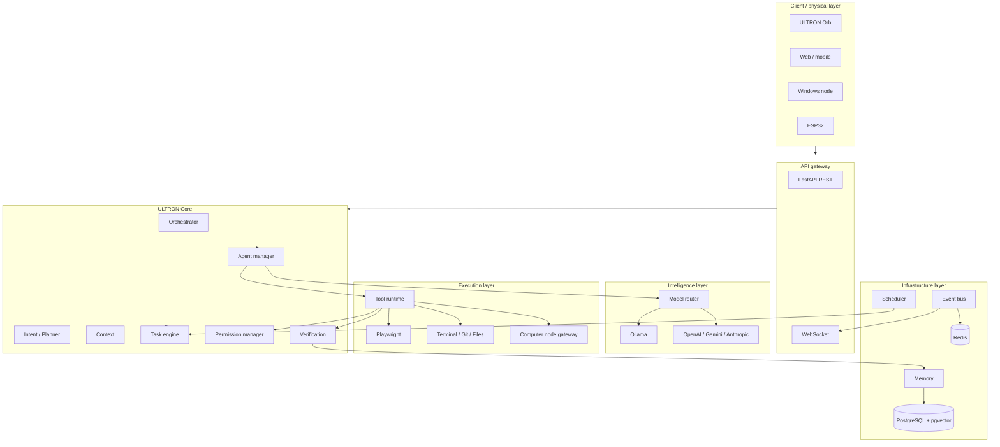

# ULTRON

**Local-first, agentic AI operating environment.**

ULTRON is not a chatbot and not an LLM. ULTRON is the orchestration platform
*around* models: it coordinates models, agents, tools, tasks, memory, browser
automation, coding agents, computer-control nodes, voice, IoT devices,
scheduling, permissions, verification, events, persistent state and
observability.

> The UI never becomes the brain, and the LLM never becomes the operating system.

This repository is the **monorepo**. This directory holds the server.

```
ULTRON
  ├── server/         FastAPI backend - the actual brain and execution environment
  ├── clients/        Orb, desktop node, and the shared node protocol
  ├── deployment/     Docker, Compose, systemd, operational scripts
  ├── docs/           Architecture and operations documentation
  └── scripts/        Developer workflow scripts (Windows + Linux)
```

---

## Status

Phases are built and verified in order. See [`tasks.md`](tasks.md) for the
live task log and [`server_arc.md`](server_arc.md) for the specification.

| Phase | Scope | Status |
|---|---|---|
| 0 | Prerequisites and repository foundation | **complete** |
| 1 | Foundation: config, logging, PostgreSQL, Redis, API, WebSocket | in progress (4 of 17: config, logging, errors, DB session) |
| 2 | Core: events, permissions, tools, tasks, agents, orchestrator | not started |
| 3 | Model system: Ollama, OpenAI, Gemini, Anthropic, router | not started |
| 4 | Coding agent: workspaces, OpenCode engine, verification | not started |
| 5 | Tool runtime: filesystem, terminal, git, python, web, system | not started |
| 6 | Research and browser agents | not started |
| 7 | Memory: short/long/episodic/semantic/project | not started |
| 8 | Computer node gateway and agent | not started |
| 9 | Voice: STT, TTS, wake word | not started |
| 10 | ESP32 / IoT device gateway | not started |
| 11 | Automation: scheduler, triggers, notifications | not started |
| 12 | Observability: metrics, monitoring, Grafana | not started |
| 13 | Production deployment: Docker, systemd, Ubuntu | not started |

---

## Architecture



### Non-negotiable rules

1. ULTRON Core is never coupled directly to a single model provider.
   Everything goes through an adapter.
2. An LLM never receives unrestricted operating-system access. Every tool call
   passes schema validation → permission check → policy check → execution →
   verification.
3. A specific agent framework is never the foundation of the architecture.
4. Agents cannot bypass the Core's permission and event systems.
5. ULTRON never assumes success. Results are `SUCCESS`, `PARTIAL`, `FAILED` or
   `UNVERIFIED`, decided by the verification subsystem.
6. PostgreSQL is authoritative. Redis holds only temporary state.
7. Nothing is faked. An unavailable subsystem reports unavailable; it never
   pretends to work.

---

## Requirements

| Component | Version | Notes |
|---|---|---|
| Python | 3.12+ | Backend runtime |
| [uv](https://docs.astral.sh/uv/) | latest | Dependency and environment management |
| Docker | 24+ | PostgreSQL and Redis during development |
| PostgreSQL | 15+ | Authoritative store, with `pgvector` |
| Redis | 7+ | Cache, queues, pub/sub, locks |
| Ollama | 0.3+ | Optional. Local models on the deployment host |

Ollama is **not** required. The server boots and runs with every cloud provider
unconfigured, and the system must function with only Ollama configured.

---

## Quickstart

### 1. Configure

```bash
cp .env.example .env
# Windows
Copy-Item .env.example .env
```

Generate a JWT secret:

```bash
python -c "import secrets; print(secrets.token_urlsafe(64))"
```

At minimum, change `JWT_SECRET`, `ADMIN_PASSWORD` and the `DATABASE_URL`
password. Never commit `.env`.

### 2. Install

```bash
# Linux
./scripts/setup.sh
# Windows
.\scripts\setup.ps1
```

### 3. Infrastructure

```bash
docker compose up -d postgres redis
```

### 4. Migrate and run

```bash
docker compose run --rm ultron-api alembic upgrade head

# Linux
./scripts/dev.sh
# Windows
.\scripts\dev.ps1
```

### 5. Verify

```bash
curl http://localhost:8000/health
curl http://localhost:8000/ready
curl http://localhost:8000/metrics
```

| Endpoint | Purpose |
|---|---|
| `/health` | Liveness. Process is up. |
| `/ready` | Readiness. Dependencies reachable. |
| `/metrics` | Prometheus metrics. |
| `/ws` | WebSocket event stream. |

---

## Development

| Script | Windows | Linux | Purpose |
|---|---|---|---|
| setup | `setup.ps1` | `setup.sh` | Create venv, install dependencies |
| dev | `dev.ps1` | `dev.sh` | API with auto-reload |
| start | `start.ps1` | `start.sh` | API without reload |
| lint | `lint.ps1` | `lint.sh` | ruff + mypy |
| format | `format.ps1` | `format.sh` | ruff format + fixes |
| test | `test.ps1` | `test.sh` | pytest |

The static gate runs in the order required before any feature is considered
complete: `format → lint → type check → unit tests → integration tests`.

```bash
./scripts/format.sh
./scripts/lint.sh
./scripts/test.sh            # unit only
./scripts/test.sh --all      # includes integration
```

The test suite passes on a bare checkout with no Docker and no paid API keys.
Integration tests skip themselves when PostgreSQL or Redis are unreachable.

---

## Configuration

All configuration comes from environment variables. See
[`docs/configuration.md`](docs/configuration.md) for the full reference and
[`.env.example`](.env.example) for every supported variable.

Nothing is hard-coded: no API keys, no model names, no Windows paths. The same
codebase runs on Windows for development and on Ubuntu Server for production.

---

## Deployment

Target layout on Ubuntu Server:

```
/opt/ultron/
  server/        application code
  deployment/    Docker, systemd, scripts
  config/        configuration and .env
  workspaces/    agent git workspaces
  logs/          structured logs
  data/          persistent non-database data
```

```bash
git clone <repo> /opt/ultron/server
cd /opt/ultron/server
cp .env.example .env && $EDITOR .env
docker compose up -d
docker compose run --rm ultron-api alembic upgrade head
curl http://localhost:8000/ready
```

See [`docs/deployment.md`](docs/deployment.md) for Docker and non-Docker
(systemd) paths, backup and restore, and security hardening.

---

## Repository layout

```
server/
  app/
    main.py            FastAPI application factory and lifespan
    container.py       Dependency-injection composition root
    api/               REST routes, WebSocket endpoints, dependencies
    core/              orchestrator, planner, router, executor, context,
                       permissions, events, lifecycle
    agents/            base, manager, registry, and one package per agent type
    models/            provider interface plus Ollama/OpenAI/Gemini/Anthropic
    tools/             base, registry, executor, and one package per tool family
    memory/            short-term, long-term, episodic, semantic, project
    tasks/             manager, executor, graph, state
    events/            bus, types, handlers
    voice/             stt, tts, wake, manager
    devices/           manager, esp32, protocol
    scheduler/         manager
    verification/      verifier, checks
    security/          auth, permissions, audit
    database/          session, models, repositories
    observability/     logging, metrics, health
    config/            settings
    workspaces/        project and git workspace management
  tests/               unit, integration, e2e, fixtures
  migrations/          Alembic
clients/               orb, desktop node, shared protocol
deployment/            docker, compose, systemd, scripts
docs/                  documentation
```

---

## License

MIT. See [`LICENSE`](LICENSE).
